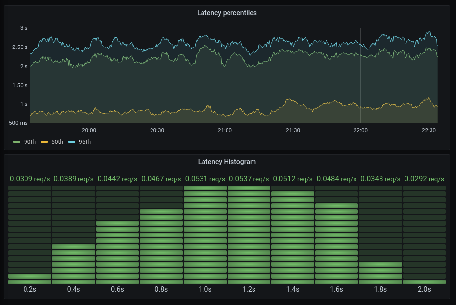

JUG Oberpfalz - Prometheus for Java Developers
==============================================

Notes for my [talk](https://www.meetup.com/de-DE/JUG-Oberpfalz/events/274962707/) at the Java User Group Oberpfalz on 17 March 2021.

Demo App
--------

Create an app on [https://start.spring.io](https://start.spring.io) with

* Spring Web
* Actuator
* Prometheus

Add a controller:

```java
package com.example.demo;

import io.micrometer.core.instrument.MeterRegistry;
import org.springframework.web.bind.annotation.GetMapping;
import org.springframework.web.bind.annotation.PathVariable;
import org.springframework.web.bind.annotation.RestController;

import java.util.Random;

@RestController
public class GreetingController {

  private final Random random = new Random();
  private static final String GREETING_CALLS_METRIC = "greeting.calls.total";

  private final MeterRegistry registry;

  public GreetingController(MeterRegistry registry) {
    this.registry = registry;
  }

  @GetMapping("/hello/{name}")
  public String hello(@PathVariable("name") String name) {
    sleep();
    registry.counter(GREETING_CALLS_METRIC, "action", "hello", "name", name).increment();
    return "Hello, " + name + "!\n";
  }

  @GetMapping("/goodbye/{name}")
  public String goodbye(@PathVariable("name") String name) {
    sleep();
    registry.counter(GREETING_CALLS_METRIC, "action", "goodbye", "name", name).increment();
    return "Goodbye, " + name + "!\n";
  }

  public void sleep() {
    double randomSleepSeconds = 0;
    while (randomSleepSeconds <= 0) {
      randomSleepSeconds = random.nextGaussian() + 1.0;
    }
    try {
      Thread.sleep((long) (1000.0 * randomSleepSeconds));
    } catch (InterruptedException e) {
      e.printStackTrace();
    }
  }
}
```

Add the following to `application.properties`:

```
management.endpoints.web.exposure.include=health,prometheus
```

run

```
./mvnw spring-boot:run
```

Generate traffic

```sh
watch -n 2 curl http://localhost:8080/hello/fabian
watch -n 3 curl http://localhost:8080/hello/oberpfalz
watch -n 5 curl http://localhost:8080/goodbye/fabian
watch -n 7 curl http://localhost:8080/goodbye/oberpfalz
```

View metrics on [http://localhost:8080/actuator](http://localhost:8080/actuator).

Prometheus
----------

Download Prometheus from [https://prometheus.io](https://prometheus.io). Add to `prometheus.yml`:

```
- job_name: spring-boot-app
  metrics_path: /actuator/prometheus
  static_configs:
  - targets:
    - localhost:8080
```

Run `./prometheus`. On [http://localhost:9090](http://localhost:9090), show a few queries:

```
greeting_calls_total
greeting_calls_total[5m]
rate(greeting_calls_total[5m])
rate(greeting_calls_total{name="fabian"}[5m])
sum by (action) (rate(greeting_calls_total[5m]))
```

Talk about cardinality explotion.

Grafana
-------

Download Grafana from [https://grafana.com](https://grafana.com). Configure the Prometheus data source.

Demo:

* Stacked graph with bars
* unit requests / second

Average Latency
---------------

View the built-in timer metric

* `http_server_requests_seconds_count`: Number of requests
* `http_server_requests_seconds_sum`: Time spent in total

Average latency

```
http_server_requests_seconds_sum / http_server_requests_seconds_count
```

Show [slides](https://docs.google.com/presentation/d/1kew_HA78CrOQi2yreRrIx_4HwnfOWk9d2-JtRkqN8Ew/edit?usp=sharing) 2, 3, 4 on drawbacks of average.

Percentiles
-----------

Add to `application.properties`:

```
management.metrics.distribution.percentiles.http.server.requests=0.5,0.9,0.95,0.99
```

View percentile metrics.

```
http_server_requests_seconds{uri="/hello/{name}", quantile=~".*"}
```

Show [slide](https://docs.google.com/presentation/d/1kew_HA78CrOQi2yreRrIx_4HwnfOWk9d2-JtRkqN8Ew/edit?usp=sharing) 5 on drawbacks of percentiles.

Histograms
----------

Show [slide](https://docs.google.com/presentation/d/1kew_HA78CrOQi2yreRrIx_4HwnfOWk9d2-JtRkqN8Ew/edit?usp=sharing) 6 on histogram aggregation.

Enable histogram with custom bucket boundaries in `appliction.properties`:

```
management.metrics.distribution.slo.http.server.requests=200ms, 400ms, 600ms, 800ms, 1000ms, 1200ms, 1400ms, 1600ms, 1800ms, 2000ms
```

View buckets in Prometheus:

```
rate(http_server_requests_seconds_bucket{uri="/hello/{name}", le=~"[0-9].[0-9]"}[5m])
```

Visualize in Grafana:

* Bar gauge
* Heat map
* `rate(http_server_requests_seconds_bucket{uri=~"/hello.*", le=~"[0-9]\\.[0-9]"}[5m])`
* legend: `{{le}}s`



Aggregating histograms:

```
sum by (le) (http_server_requests_seconds_bucket)
sum by (le) (rate(http_server_requests_seconds_bucket[5m]))
```

Quantiles from histograms

```
histogram_quantile(0.5, sum by (le) (rate(http_server_requests_seconds_bucket[5m])))
```

Percentiles are good for alerting

Heads-Up: Percentiles may be misleading for multimodal distributions, see [slide](https://docs.google.com/presentation/d/1kew_HA78CrOQi2yreRrIx_4HwnfOWk9d2-JtRkqN8Ew/edit?usp=sharing) 7.

Heads-up
--------

* If you don't know good bucket sizes in advance, enable the default buckets `management.metrics.distribution.percentiles-histogram.http.server.requests=true`
* There are multiple ways to create your own timer metrics (you don't want to use `http_server_requests_seconds` for everything):
  * `@Timed("my.timer")` annotation
  * `Timer` interface (via `registry.timer(...)` or `Timer.builder(...)`

Outlook / Topics not Covered
----------------------------

* Alerting rules, see [https://prometheus.io/docs/prometheus/latest/configuration/alerting_rules/](https://prometheus.io/docs/prometheus/latest/configuration/alerting_rules/)
* Other metric types: distribution summary, gauge.

Alternative Java Libraries
--------------------------

The official Prometheus Java client libary [https://github.com/prometheus/client_java](https://github.com/prometheus/client_java).
